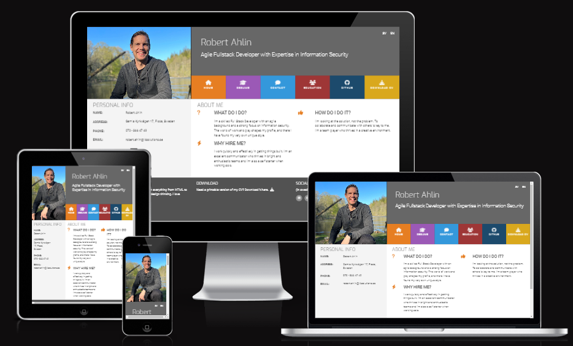

Welcome,

This project was from the start a to train Bootstrap4. 
I made the page personal instead of generic. As I want to have a site that can show my skills with a CV, I have continously developed it.

Visit the live version at: http://www.ahlin.org

The page is available in both Swedish and English.

Latest updates:
- Uplaod updated CV as pdf.
- Changed profile picture.
- Fixed contact forms.
- Fixed social media icons in footer.
- Uploaded new CV.
- Added option to select Swedish (SV) or English (EN) langage.

Future development and fix:  
- Make code DRY - Header, footer and Navbar.
- Add project and reference objects.